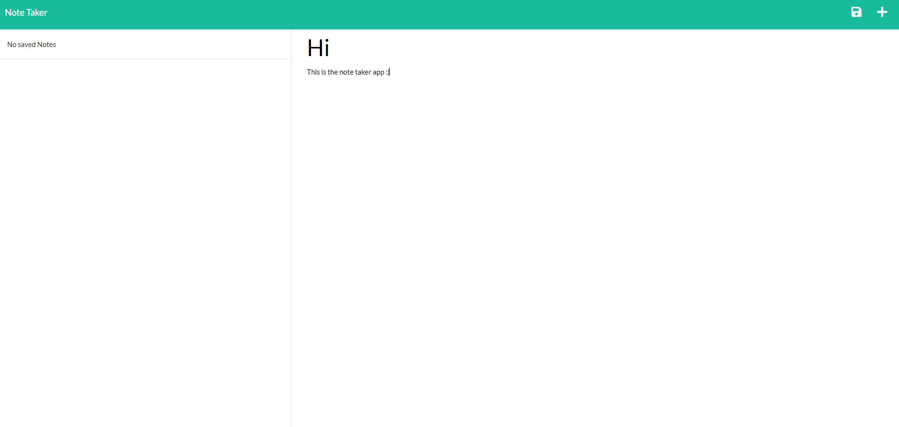

# Note Taker

## Description
This note taker app uses an express backend. The user is able to add and delete notes.

## Table of Contents
* [Installation](#installation)
* [Usage](#usage) 
* [Questions](#questions)

## Installation
Please run "npm i" in the command line and ensure that "express" and "uuid" dependencies are installed.

## Usage
To run the application, input "node server.js" in the command line and open your browser to localhost:3000.

## Questions
If you have any questions about this projects, please contact me directly at taylorpterrill@gmail.com. You can view more of my projects at https://github.com/taylorterrill.